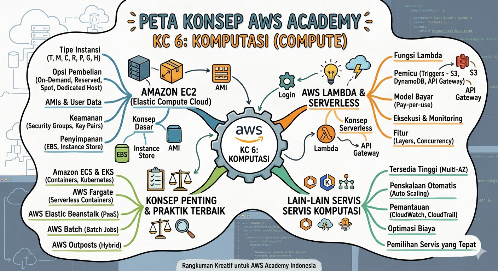

```{=html}
<p style="color:#64748b; font-size:0.95rem; margin-top:-10px; margin-bottom:28px;">
  Gambar rangkuman yang telah dibuat, sebagai referensi cepat materi EC2
</p>
```

---

## 📸 Galeri Rangkuman

### Konsep Dasar EC2

```{=html}
<div class="img-gallery">

  <div class="img-card">
    
    <div class="img-caption">🖥️ Pengenalan Amazon EC2, gambar didukung oleh Gemini AI</div>
  </div>
</div>
```

---

## 📝 Ringkasan Tabel Cepat

| Topik | Poin Utama |
|---|---|
| EC2 | Server virtual di AWS, bayar sesuai pakai |
| AMI | Template OS + software untuk buat instance |
| Instance Type | Pilih berdasarkan CPU/RAM/storage yang dibutuhkan |
| On-Demand | Fleksibel, tanpa komitmen, harga normal |
| Reserved | Diskon besar, komitmen 1–3 tahun |
| Spot | Termurah, bisa diputus AWS kapan saja |
| EBS | Storage persisten untuk EC2 |
| Security Group | Firewall virtual, atur port yang boleh diakses |
| Key Pair | Kunci SSH untuk login ke instance Linux |
| Stop vs Terminate | Stop = matikan sementara; Terminate = hapus permanen |